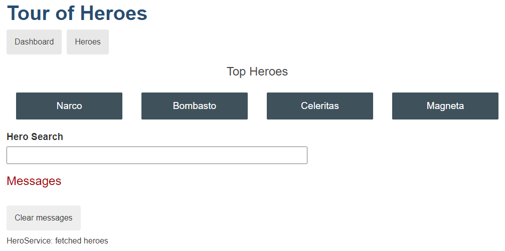
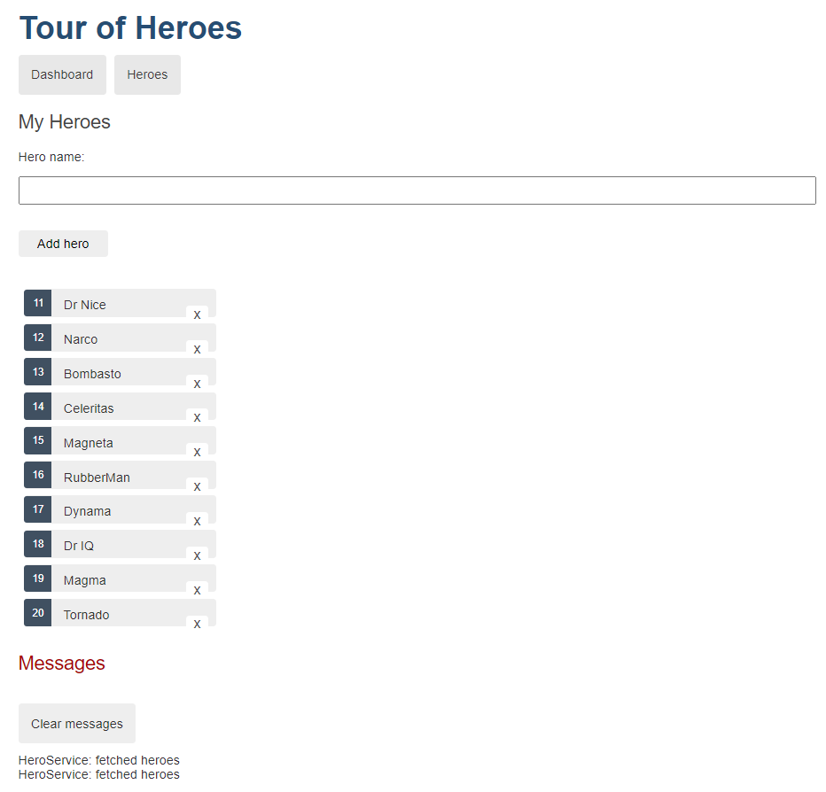

# ANGULAR - Tour of Heroes
Proyecto desarrollado con Angular para realizar un front que permite Alta, Baja y Modificación de Héroes.

Se utilizó: 
- HTML
- CSS
- TypeScript

# Visuales

### Vista de dashboard

### Vista de heroes

